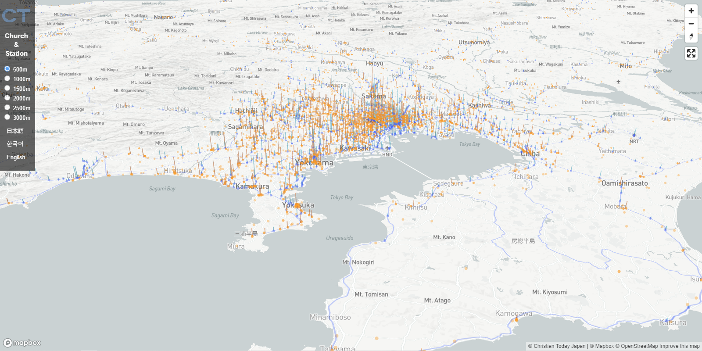

# Church & Station

[Church & Station](https://www.christiantoday.co.jp/infographics/church-station/) is a Christian Data Journalism project of 
[Christian Today Japan](https://www.linkedin.com/company/christian-today-japan/) 
designed to help church planters find unreached areas in Japan 
by visualizing train stations with more than 1000 passengers without no churches around the specified distance.
It is a single page web application with full screen map plotting churches and train stations of Japan.

It is available in languages spoken in 2 biggest missionary sending neighbour countries of Japan, English and Korean as well as Japanese 
so that those who in charge of making mission strategy can be free from language barrier.
Those who support mission by prayer, giving, or training can also benefit from the project learning unreached area in Japan visually.

Distance from stations to Churches can be switched from 500m to 3km. (Elderly gets tired with shorter walk while younger feels fine walking longer.)
The application reads your browser language. When it detects ```en-US```, the distance unit will be transformed into miles.

## Why train stations?
[Rail transport in Japan](https://en.wikipedia.org/wiki/Rail_transport_in_Japan) is advanced compared to many countries.
Churches in Japan take advantage of the railway network for Evangelism promoting distance from nearby station.
People use train to visit churches in most cities in Japan.

## Legend
* **Blue bar graph:** stations without churches with hight representing the number of passengers (a logarithmic graph).
* **Blue dots:** same as above when seen in zoom out view where height of the bar gets unrecognizable.
* **Orange graph and dots connected each other:** Church & Station pairs within the specified range.
* **Orange dots:** Churches including ones outside of the specified range.



## Data Source
Geographic data of train stations in Japan was obtained from [Ministry of Land, Infrastructure, Transport and Tourism](https://www.mlit.go.jp/en/).
Church data is gathered by Christian Today Japan. Distance data is computed at [cpsd: church planting strategy database](https://github.com/nehemiaharchives/cpsd).
